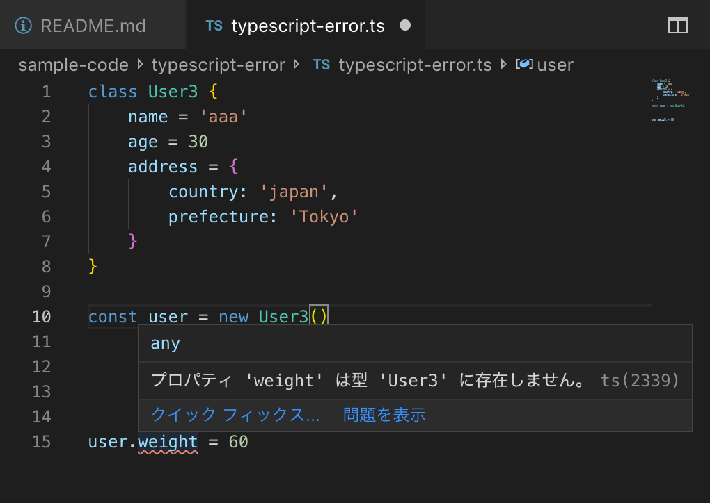

# TypeScript勉強会資料

TypeScriptを利用する事による主な利点

* WebStormやvs code使用時の型ベースの補完機能
* コンパイル時の型チェック

## 型によるコード補完

### JavaScriptでも実現される型推論

直前で変数が宣言されていたり、特定の型で再代入されていたりする場合は、最近のエディタなら、javaScriptでもコード補完してくれる

**特定のクラスのインスタンスに対するコード補完の例**


また、関数の返り値の型が自明な場合も、型推論によってコード補完してくれる

**関数の返り値の型が自明な場合のコード補完の例**


もちろんTypeScriptでも上記の型推論によるコード補完は利用できる

### TypeScriptで解決できる課題

#### 関数の引数に対するコード補完

javascriptでは関数の引数に型を宣言することができない。
そのため、関数の引数に対しては型推論を行うことができず、コード補完を行うこともできない。

TypeScriptでは以下のような形で関数の引数に型宣言することができる。
この方宣言を元に、エディタはコード補完を行うことができる

```
class User2 {
    name = 'aaa'
    age = 30
    address = {
        country: 'japan',
        prefecture: 'Tokyo'
    }
}

// 引数の後ろに「: 型」の形で型を宣言することができる。この型宣言は省略することもできる。
// その場合はjavascriptと同様にany型として扱われる
function setCountry(user: User2, country: string) {
    user.address.country = country
}
```


これにより、ほぼすべてのコードでコード補完を行うことができるようになる。

このような型定義をきちんと行うことにより、以前書いたコードをエンハンスする際に、APIのドキュメントを読んだり、Networkタブで実際のリクエストの中身を確認したり、デバッカーで止めたりしないと、オブジェクトのプロパティがわからなくなる問題を防ぐことができる。

オブジェクトの中身を知るためだけにコーディング作業を中断するといったことがなくなるため、快適なコーディング体験を得ることができる

また、関数の引数や返り値の型が自明なため、データ構造に言及する記述を、JSDoc側には書く必要がなくなる。これは特に、一つのオブジェクトが大量のヘルパー関数を経由する場合などに有効である。

#### 型による制約による実行時エラーの防止

コードの中で自在にプロパティを追加したり削除したりして、動的に型を変えていけるJavaScriptに対して、TypeScriptでは基本的には、最初に宣言した型以外のプロパティを追加したり削除したり、参照したりすることはできない。

これによって、意図しない型の変更や存在しないプロパティへのアクセスを未然に防ぐことができる。

例えば、以下のようなコードはエラーになる

```
class User3 {
    name = 'aaa'
    age = 30
    address = {
        country: 'japan',
        prefecture: 'Tokyo'
    }
}

const user = new User3()

console.log(user.weight)    // Type Error weightはuserに存在しない
user.weight = 60    // Type Error weightはuserに存在しない
```

**型チェックによるエラーの例**


とはいえ、上記のように新たなプロパティを追加したくなる時はある。
その場合はスプレッド演算子を用いて新たなオブジェクトを生成してしまうのが一番手っ取り早い

```
class User3 {
    name = 'aaa'
    age = 30
    address = {
        country: 'japan',
        prefecture: 'Tokyo'
    }
}

const user = new User3()

const newUser = {
    ...user,
    weight:60
}

newUser.weight = 65  // Errorにならない
```